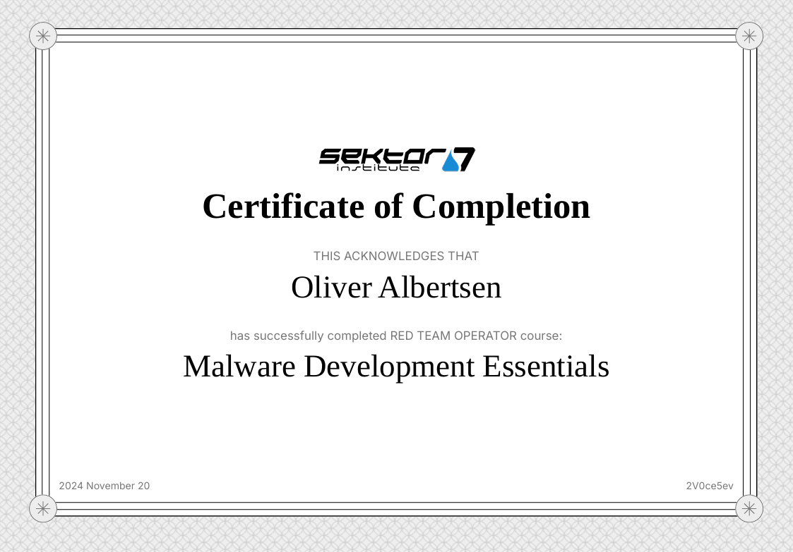
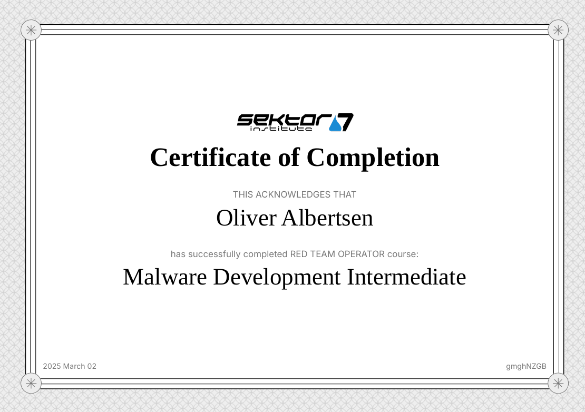
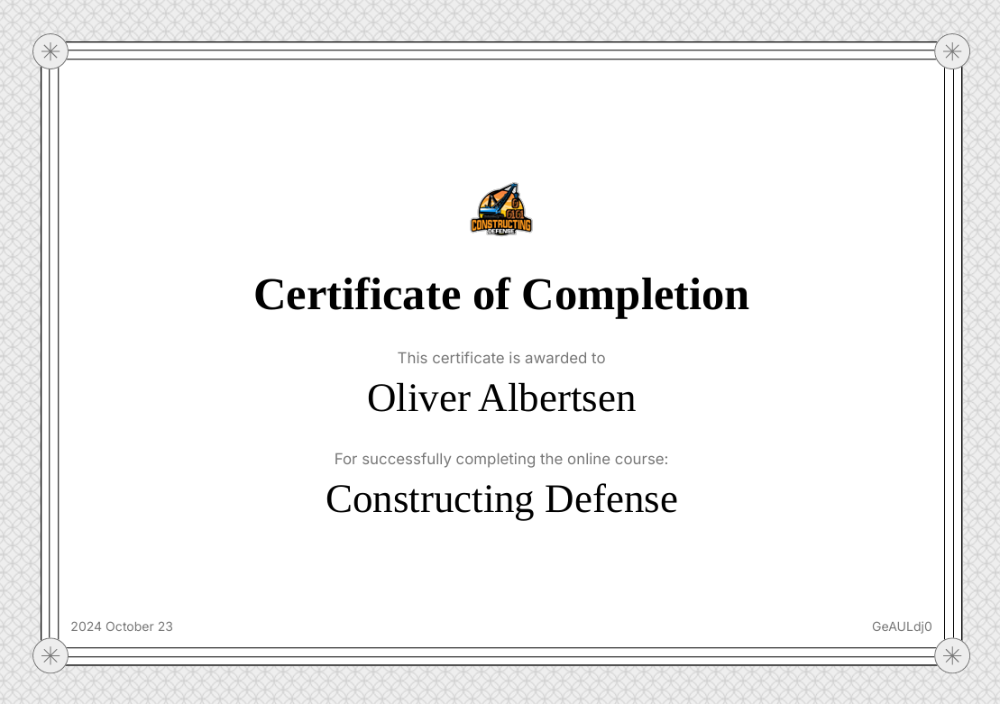

---
# the default layout is 'page'
icon: fas fa-info-circle
order: 4
---

## Primusinterp
---
Red Teamer with a passion for testing Active Directory and Offensive Tool Development. I love to learn new skills and expand my repertoire of knowledge. 

- Github: [https://github.com/Primusinterp](https://github.com/Primusinterp)

# My Certificates: 

### CRTO

  <blockquote class="badgr-badge" style="font-family: Helvetica, Roboto, &quot;Segoe UI&quot;, Calibri, sans-serif;">
    
    
Red Team Operator

    

      <strong style="font-size: 12px; font-weight: bold; font-style: normal; font-stretch: normal; line-height: 1.67; letter-spacing: normal; text-align: left; color: #000;">Awarded: </strong>May 26, 2024
    

    

      <strong style="font-size: 12px; font-weight: bold; font-style: normal; font-stretch: normal; line-height: 1.67; letter-spacing: normal; text-align: left; color: #000;">Awarded To: </strong>
       Oliver Albertsen
    

    

      <a class="badgr-badge-verify" target="_blank" href="https://badgecheck.io?url=https%3A%2F%2Fapi.eu.badgr.io%2Fpublic%2Fassertions%2FkI3ea9BGTXOivk5QCMFU6g" style="box-sizing: content-box; display: flex; align-items: center; justify-content: center; margin: 0; font-size:14px; font-weight: bold; width: 48px; height: 16px; border-radius: 4px; border: solid 1px black; text-decoration: none; padding: 6px 16px; margin: 16px 0; color: black;">VERIFY</a>
    

    
  </blockquote>

### CRTP
<iframe
  src="https://www.credential.net/embed/0e093b87-6b42-419a-810b-be703b11a167"
  width="800"
  height="600"
  frameborder="0"
  allowfullscreen>
</iframe>

### PNPT
<iframe
  src="https://www.credential.net/embed/0158b44b-a93f-4f0b-b318-9f1e4332e2fd"
  width="800"
  height="600"
  frameborder="0"
  allowfullscreen>
</iframe>

### eJPT
<iframe
  src="https://certs.ine.com/embed/add0059c-eebf-4096-8d27-bdb71659c28a"
  width="800"
  height="600"
  frameborder="0"
  allowfullscreen>
</iframe>

### AZ900

# Courses 

## Sektor 7 Malware Development Essentials

## Sektor 7 Malware Development Intermediate

## Constructing Defense
